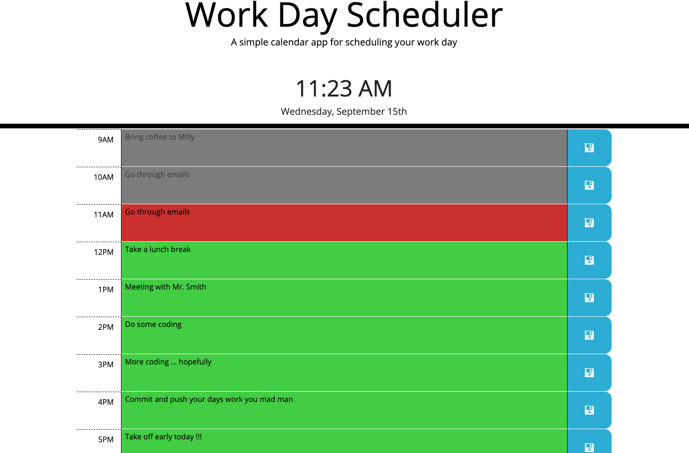

# Work Day Scheduler

A simple calendar application that allows the user to save events for each hour of the day. This app runs in browser and features dynamically updated HTML and CSS using jQuery DOM manipulation. As well as a suite of third party APIs to provide slick functionality. [Click here](https://qcent.github.io/day-calendar/) to view the App

## Aforementioned Functionality
* On page open the current calendar day will be displayed
* Time-blocks for standard business hours will be presented
* Each time-block is colour coded to indicate whether it is past, present, or future
* Click to edit time-blocks
* Save edit with a button click to localStorage
* Load saved events from localStorage on page load
* Will perform aesthetically on all screen sizes



## 3rd Party APIs

This project will put heavy emphasis on using `jQuery` and other 3rd party APIs to quickly add professional looking functionality to app.

* Use [Bootstrap](https://getbootstrap.com/) for grid layout and styling.
* Use [jQuery](https://jquery.com/) for accelerated DOM manipulation.
* Use [Google Fonts](https://fonts.google.com/) and [Open Iconic](https://useiconic.com/open) to provide free fonts and icons to give the app a more polished look.
* Use ~~[Moment.js](https://momentjs.com/)~~ [Luxon](https://moment.github.io/luxon/#/?id=luxon) for comparing due dates of tasks.
* Use browser provided [Intl.PluralRules](https://developer.mozilla.org/en-US/docs/Web/JavaScript/Reference/Global_Objects/Intl/PluralRules) for adding ordinals to date output.

## Programming Challenges

I encountered a few technical issues and had to rack my brains and scour the internet to come up with solutions.  I will discuss these problems below.

1. When editing the time-block event and then clicking on the save button. I struggled to find a proper way to account for the blur event on the textarea, which I wanted to reset the event text to it's pre edit state if the save was not clicked, and the click event on the save button happening at the same time. After what felt like endless experimenting I finally turned to google and eventually found `event.relatedTarget`. The event object is provided by the binding function, in this case .on('blur', 'textarea', function(event)). For a blur event the event.target refers to the blurred object and the event.relatedTarget refers to the element that gained focus. Of course there was still one caveat remaining, that a div element, which is acting as a button in this instance, cannot receive focus without having a `tabindex` attribute. So one more method got thrown into my jQuery chain to set the saveBtn element: `.attr('tabindex',0)`. Below is my final event delegation. 
```
// Event text being edited lost focus
$("#Timeblocks").on("blur", "textarea", function(event) {

    // get the parent time-block's id attribute 
    var tbId = $(this).closest(".time-block").attr("id").replace("tb-", "");

    //if relatedTarget is a saveBtn with same parent id then save new text 
    if (event.relatedTarget && event.relatedTarget.matches(".saveBtn") &&
      $(event.relatedTarget).closest(".time-block").attr("id").replace("tb-", "") === tbId) {
        saveTimeBlock(this, tbId);
        
    } else { //else restore old text

        //recreate p element with text saved in localstorage/daysEvents
        var eventP = $("<p>").addClass(eventClassList).text(daysEvents[tbId]);
        //Add the bg-color
        addEventBgColor(eventP, tbId);
        // replace textarea with p element
        $(this).replaceWith(eventP);
    }
});

```

2. A lack of native ordinal support using the Luxon API for handling DateTime objects had me exhaust the Luxon documentation and turn to good ol' [Google](https://google.ca/) where I quickly discovered [Intl.PluralRules](https://developer.mozilla.org/en-US/docs/Web/JavaScript/Reference/Global_Objects/Intl/PluralRules). (https://v8.dev/features/intl-pluralrules) shows an example of how to achieve ordinal output as such:
```
const pr = new Intl.PluralRules('en-US', {
  type: 'ordinal'
});
const suffixes = new Map([
  ['one',   'st'],
  ['two',   'nd'],
  ['few',   'rd'],
  ['other', 'th'],
]);
const formatOrdinals = (n) => {
  const rule = pr.select(n);
  const suffix = suffixes.get(rule);
  return `${n}${suffix}`;
};

formatOrdinals(0);   // '0th'
formatOrdinals(1);   // '1st'
formatOrdinals(2);   // '2nd'
formatOrdinals(3);   // '3rd'
formatOrdinals(4);   // '4th'
formatOrdinals(11);  // '11th'
formatOrdinals(21);  // '21st'
formatOrdinals(42);  // '42nd'
formatOrdinals(103); // '103rd'

```
Im not too sure how this performs it's magic with the Mapping of the suffixes and the `.get(rule)` but it definitely worked for me. I wrapped the three consts in a function that takes an integer as an argument and returns formatOrdinals(int). I did this mainly to make my code look cleaner with less subroutines to collapse.

3. Creating a date and time element that would scroll up to and then stay at the top of the screen as you scrolled through the day's time-blocks was not part of the mock-up but I felt this would be a cool user experience to add. I thought this would just require a simple css position of sticky applied to the #time-date-container  element but it turned out to be much more involved. The css style switching needed to be calculated and performed on the fly as the page scrolled. A comparison of the distance, from the top of the page to the top of the #time-date-container,  and the distance the page has scrolled. After finding the methods required to calculate the on screen size of the elements, I found that the time-blocks would jump up behind the #time-date-container when it was taken out of the standard DOM flow upon being set to position:fixed. This required I set the position of the #time-date-container to relative, at a distance of the #time-date-container's height from the top of screen.
```
$(window).scroll(function() {
    // height of the time/date element :: no margins
    let heightOfTime = parseInt(document.querySelector('#date-time-container').offsetHeight);

    // calculate the distance between the top of header and the top of time/date
    let heightOfHeader = parseInt(document.querySelector('.jumbotron').offsetHeight); //the header
    let headerMargin = parseInt(getComputedStyle(document.querySelector('.jumbotron')).marginTop); //headers margin
    let timeMargin = parseInt(getComputedStyle(document.body).getPropertyValue('font-size').replace("px", '') * 2); 
    //the time-date-container top-margin is 2rem this calcs in px :: font-size*2
    //only used this convoluted method to demonstrate the possibility to calc rem sizes.
    //the .marginTop as seen above would work here just fine
    
    let totalHeight = (heightOfHeader + headerMargin + timeMargin); // add it all up

    let dateEl = $('#date-time-container'); //get a reference to time-date-container
    let hasFixedPos = (dateEl.css('position') == 'fixed'); // a boolean to determine if dateEl's position is fixed
    if ($(this).scrollTop() > totalHeight && !hasFixedPos) { // if the window has scrolled past the totalHeight and dateEl is not in a fixed position  
        dateEl.css({ 'position': 'fixed', 'top': '0px' }); // set dateEl's position to fixed at top of window
        $('.container').css({ 'position': 'relative', 'top': heightOfTime + 'px' }); // set the container of the time-blocks position to prevent content jumping
    }
    if ($(this).scrollTop() <= totalHeight && hasFixedPos) { // if scrolled back up return everything to default
        dateEl.css({ 'position': 'static', 'top': '0px' });
        $('.container').css({ 'position': 'static', 'top': '0px' });
    }
});

```

## License
`day-calendar` is Copyright 2021 Dave Quinn - Quinnco Enterprises.

`day-calendar` is licensed under the [MIT License](https://opensource.org/licenses/MIT).

Copyright 2021 Dave Quinn

Permission is hereby granted, free of charge, to any person obtaining a copy of this software and associated documentation files (the "Software"), to deal in the Software without restriction, including without limitation the rights to use, copy, modify, merge, publish, distribute, sublicense, and/or sell copies of the Software, and to permit persons to whom the Software is furnished to do so, subject to the following conditions:

The above copyright notice and this permission notice shall be included in all copies or substantial portions of the Software.

THE SOFTWARE IS PROVIDED "AS IS", WITHOUT WARRANTY OF ANY KIND, EXPRESS OR IMPLIED, INCLUDING BUT NOT LIMITED TO THE WARRANTIES OF MERCHANTABILITY, FITNESS FOR A PARTICULAR PURPOSE AND NONINFRINGEMENT. IN NO EVENT SHALL THE AUTHORS OR COPYRIGHT HOLDERS BE LIABLE FOR ANY CLAIM, DAMAGES OR OTHER LIABILITY, WHETHER IN AN ACTION OF CONTRACT, TORT OR OTHERWISE, ARISING FROM, OUT OF OR IN CONNECTION WITH THE SOFTWARE OR THE USE OR OTHER DEALINGS IN THE SOFTWARE.

